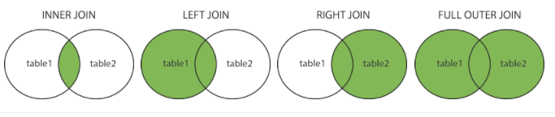

- **what are the Different Types of SQL JOINs**

  - **(INNER) JOIN:** Returns records that have matching values in both tables
  - **LEFT (OUTER) JOIN:** Returns all records from the left table, and the matched records from the right table
  - **RIGHT (OUTER) JOIN:** Returns all records from the right table, and the matched records from the left table
  - **FULL (OUTER) JOIN:** Returns all records when there is a match in either left or right table

  

- **Sql query to get the fifth highest salary inside employees table**

  sort data --> limit it to 5 --> take the fifth value.
